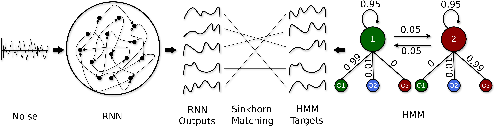

# Mechanistic Interpretability of RNNs emulating Hidden Markov Models



This repository contains code for training, analyzing, and reverse engineering Recurrent Neural Networks (RNNs) trained on data generated from Hidden Markov Models (HMMs). The project focuses on understanding the internal representations and dynamics of RNNs at the single-neuron level.

## Installation

### Requirements

Install the required packages using pip:

```bash
pip install -r requirements.txt
```

Alternatively, you can create a conda environment:

```bash
conda env create -f environment.yml
conda activate hmmrnn
```

## Repository Structure

The repository is organized as follows:

- `scripts/`: Contains all Python scripts for the project
- `TrainedModels/`: Contains pre-trained RNN models (downloadable from https://drive.google.com/file/d/1qsSK-hI2xw8pl24dYlXN6ssa_0qAUFpL/view?usp=sharing)
- `main.ipynb`: Jupyter notebook with step-by-step guide to run all functions

### TrainedModels Folder

The `TrainedModels` folder contains pre-trained models organized by HMM complexity. After downloading the models, place them in the repository root directory. The structure is as follows:

- `Two/`: Models trained on 2-state HMMs
  - `hidden_50/`, `hidden_150/`, `hidden_200/`: Different hidden layer sizes
    - `input_1/`, `input_10/`, `input_100/`, `input_200/`: Different input dimensions
      - `seed_0/`, `seed_1/`, `seed_2/`: Different random seeds
        - `models/`: Trained model files
        - `config.json`: Containing metadata about RNN and HMM models

- `Three/`: Models trained on 3-state HMMs (same subfolder structure as `Two/`)
- `Four/`: Models trained on 4-state HMMs (same subfolder structure as `Two/`)
- `Five/`: Models trained on 5-state HMMs (same subfolder structure as `Two/`)
- `ReverseEngineeredModel/`: Contains the main RNN model used for detailed reverse engineering analysis at the single-neuron level

## Scripts

### main.ipynb

A Jupyter notebook that serves as a step-by-step guide to run all the functions in the project. It demonstrates how to:
- Train RNN models on HMM generated data
- Test model performance
- Perform reverse engineering analysis
- Visualize results

### config.py

Configuration module for HMM-RNN experiments. Defines different configuration classes:
- `DefaultConfig`: Base configuration with default parameters
- `HMMTwo`, `HMMThree`, `HMMFour`, `HMMFive`: Configurations for different HMM complexities

### hmm.py

Implements the Hidden Markov Model (HMM) class for generating and managing sequences. Features:
- Custom transition and emission matrix generation
- Sequence generation with different methods (linear, gaussian)
- Data splitting for training, validation, and testing

### rnn.py

Implements the Recurrent Neural Network (RNN) class. Features:
- RNN architecture with configurable input size, hidden size, and output size
- Training with Sinkhorn divergence loss
- Sequence generation with different dynamics modes
- Model saving and loading

### test.py

Implements the Test class for evaluating and comparing HMM and RNN models. Features:
- Euclidean distance calculation between matched sequences
- Volatility analysis (frequency of state changes)
- Output frequency analysis
- Transition matrix comparison
- Visualization of comparison metrics

### reverse.py

Implements the Reverse class for reverse engineering analysis of trained RNNs. Features:
- Principal Component Analysis (PCA) of hidden states
- 2D and 3D visualization of latent trajectories
- Analysis of explained variance

### manager.py

Implements the Manager class for experiment execution, data handling, and result storage. Features:
- Experiment directory structure setup
- Configuration management
- Training pipeline execution
- Test and reverse engineering analysis
- Multiple experiment execution

### metrics.py

Implements functions for comparing HMM and RNN models using various metrics:
- Transition matrix calculation and plotting
- Euclidean distance calculation and plotting
- Grid plots for comparing different model configurations 

### statespace.py

Implements functions for analyzing the state space of trained RNNs:
- Trajectory generation with and without input
- Fixed point analysis
- Variance contour plots
- Grid plots for comparing different model configurations

### mechint.py

Implements mechanistic interpretability tools for analyzing RNN dynamics:
- Residency time analysis
- Noise sensitivity analysis
- Neuron activity visualization
- Weight matrix analysis
- Ablation studies

### sinkhorn.py

Implements the Sinkhorn solver for optimal transport under entropic regularization:
- Used for matching sequences between HMM and RNN outputs
- Provides distance metrics for comparing distributions

## Usage

1. Download the TrainedModels folder and place it in the repository root
2. Open `main.ipynb` in Jupyter Notebook or JupyterLab
3. Follow the step-by-step instructions to run the analysis

## Citation

If you use this code in your research, please cite the associated publication.
